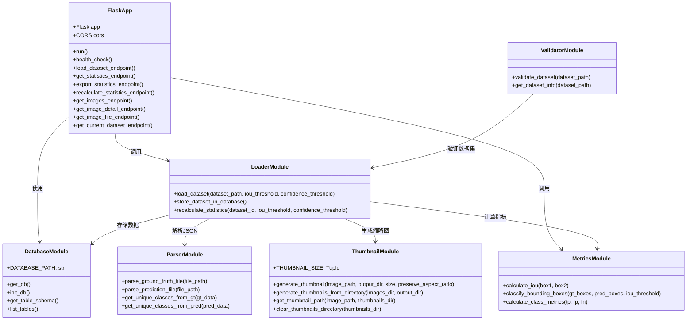
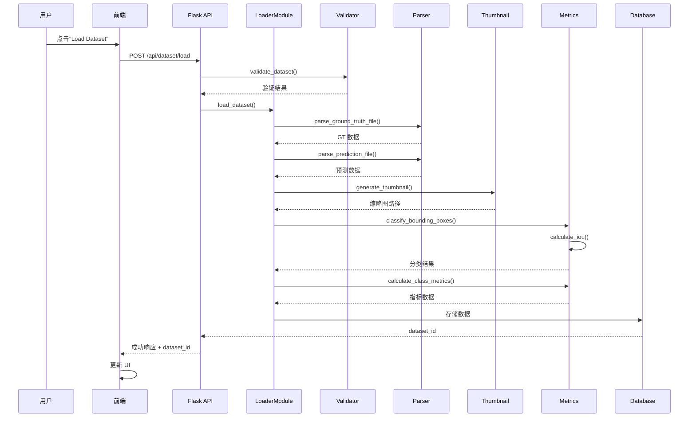
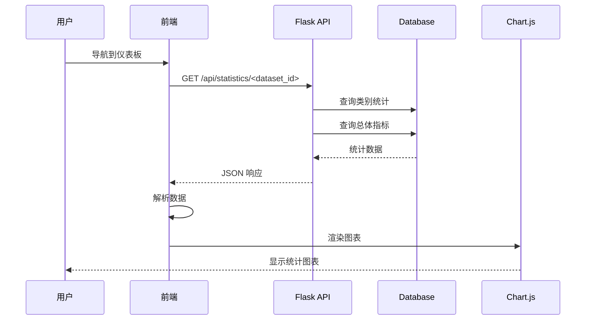
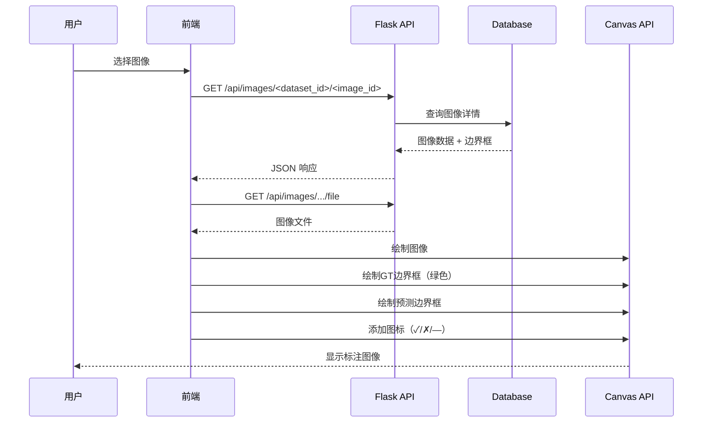
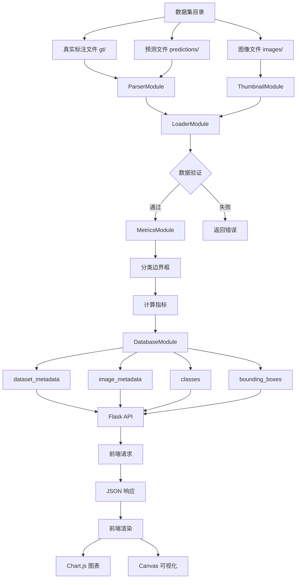
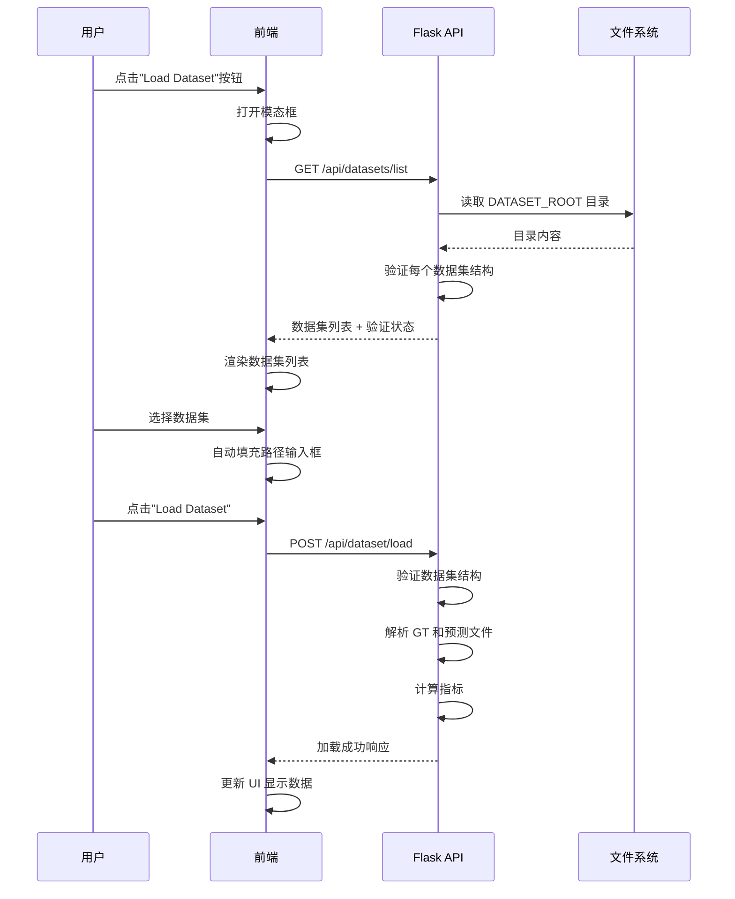

# Image Detection Result Analyzer 项目文档

## 1. 项目概述

Image Detection Result Analyzer 是一个用于分析目标检测模型性能的前端工具，通过比较真实标注（Ground Truth）与模型预测结果来评估检测模型的准确性。该应用提供了一个直观的可视化界面，支持对本地图像序列数据集进行统计分析，并按图像逐个对比检测结果。

### 主要功能

- **统计分析仪表板**：按类别显示检测指标（召回率、精确率、FPR、F1分数）
- **图像对比视图**：逐图像可视化显示真实标注和预测边界框
- **指标可视化**：使用 Chart.js 绘制统计图表
- **动态阈值调整**：支持实时调整 IoU 阈值和置信度阈值
- **数据导出**：支持 CSV 和 JSON 格式导出统计结果

<video width="640" height="480">
    <source src="videos/Image Detection Viewer.mp4" type="video/mp4">
</video>


## 2. 如何编译和运行

### 环境要求

- Python 3.8+
- Flask 2.0+
- Flask-CORS
- Pillow 9.0+
- NumPy 1.21+

### 安装依赖

```bash
pip install -r requirements.txt
```

### 运行应用

```bash
python run.py
```

应用将在 `http://localhost:5000` 启动。

### DATASET_ROOT 配置

`DATASET_ROOT` 是一个环境变量，用于指定数据集根目录的路径。应用会在该目录下搜索可用的数据集。

**配置方式**：

1. **通过环境变量设置**（推荐）：
```bash
export DATASET_ROOT=/path/to/datasets
python run.py
```

2. **使用默认值**：
如果没有设置 `DATASET_ROOT`，默认使用 `./datasets` 目录。

**目录结构**：
```
DATASET_ROOT/
├── dataset1/
│   ├── images/
│   ├── gt/
│   └── predictions/
├── dataset2/
│   ├── images/
│   ├── gt/
│   └── predictions/
└── dataset3/
    ├── images/
    ├── gt/
    └── predictions/
```

**功能说明**：
- 应用启动时会扫描 `DATASET_ROOT` 下的所有子目录
- 自动验证每个子目录是否包含必需的数据集结构（`images/`, `gt/`, `predictions/`）
- 在"Load Dataset"模态框中显示所有有效的数据集列表
- 用户可以直接点击数据集名称快速加载数据集

### 数据集结构要求

数据集目录需要包含以下子目录：

```
dataset/
├── images/          # 图像文件 (.jpg, .jpeg, .png, .bmp, .tiff, .tif)
├── gt/             # 真实标注 JSON 文件
└── predictions/     # 模型预测 JSON 文件
```

### JSON 文件格式

**真实标注文件格式 (gt/*.json)：**
```json
{
  "filename": "image.jpg",
  "width": 1920,
  "height": 1080,
  "annotations": [
    {
      "class": "car",
      "bbox": [x1, y1, x2, y2]
    }
  ]
}
```

**预测文件格式 (predictions/*.json)：**
```json
{
  "filename": "image.jpg",
  "width": 1920,
  "height": 1080,
  "predictions": [
    {
      "class": "car",
      "bbox": [x1, y1, x2, y2],
      "score": 0.95
    }
  ]
}
```

## 3. 主要实现细节

### 3.1 项目架构

项目采用前后端分离架构：

- **后端**：Flask Web 框架，提供 REST API
- **前端**：原生 HTML5 + CSS3 + JavaScript，使用 Bootstrap 5 和 Chart.js
- **数据库**：SQLite，用于存储数据集和分析结果
- **文件处理**：使用 Pillow 进行图像缩略图生成

### 3.2 类图



### 3.3 核心模块说明

#### FlaskApp (run.py)

**作用**：Flask Web 应用主程序，提供所有 REST API 端点

**主要 API 端点**：

| 端点 | 方法 | 说明 |
|------|------|------|
| `/api/health` | GET | 健康检查 |
| `/api/datasets/list` | GET | 获取 DATASET_ROOT 下的可用数据集列表 |
| `/api/dataset/current` | GET | 获取当前加载的数据集 |
| `/api/dataset/load` | POST | 加载数据集 |
| `/api/statistics/<dataset_id>` | GET | 获取统计数据 |
| `/api/statistics/export/<dataset_id>` | GET | 导出统计数据（CSV/JSON） |
| `/api/statistics/recalculate` | POST | 重新计算统计（调整阈值） |
| `/api/images/<dataset_id>` | GET | 获取图像列表（分页） |
| `/api/images/<dataset_id>/<image_id>` | GET | 获取单张图像详情 |
| `/api/images/<dataset_id>/<image_id>/file` | GET | 获取图像文件 |

#### DatabaseModule (db.py)

**作用**：SQLite 数据库操作模块，管理数据集、图像、类别和边界框数据

**数据库表结构**：

1. **dataset_metadata**：数据集元数据
   - id, path, total_images, total_classes
   - iou_threshold, confidence_threshold
   - created_at, last_updated

2. **image_metadata**：图像元数据
   - id, dataset_id, filename, width, height
   - thumbnail_path, image_path
   - total_gt_boxes, total_pred_boxes
   - has_fp, has_fn, is_perfect

3. **classes**：类别信息
   - id, dataset_id, name
   - total_gt_count, total_pred_count
   - tp_count, fp_count, fn_count
   - recall, precision, fpr, f1_score

4. **bounding_boxes**：边界框数据
   - id, image_id, class_id, type
   - x1, y1, x2, y2, confidence
   - iou, classification

#### LoaderModule (loader.py)

**作用**：数据集加载和处理的核心模块

**主要函数**：

- `load_dataset(dataset_path, iou_threshold, confidence_threshold)`：加载和解析数据集
- `store_dataset_in_database()`：将解析的数据存储到数据库
- `recalculate_statistics()`：根据新阈值重新计算统计

**处理流程**：
1. 验证数据集目录结构
2. 收集所有图像文件
3. 解析对应的 GT 和预测 JSON 文件
4. 生成缩略图
5. 计算指标并分类边界框
6. 存储到数据库

#### ParserModule (parser.py)

**作用**：解析 Ground Truth 和预测 JSON 文件

**主要函数**：

- `parse_ground_truth_file(file_path)`：解析真实标注文件
- `parse_prediction_file(file_path)`：解析预测文件（包含置信度分数）
- `get_unique_classes_from_gt(gt_data)`：从 GT 数据提取类别
- `get_unique_classes_from_pred(pred_data)`：从预测数据提取类别

**数据验证**：
- 检查必需字段存在性
- 验证边界框坐标为数值且非负
- 验证边界框尺寸有效（x2 > x1, y2 > y1）
- 验证置信度分数在 [0, 1] 范围内

#### MetricsModule (metrics.py)

**作用**：计算检测指标和分类边界框

**主要函数**：

- `calculate_iou(box1, box2)`：计算两个边界框的交并比
- `classify_bounding_boxes(gt_boxes, pred_boxes, iou_threshold)`：分类边界框为 TP/FP/FN
- `calculate_class_metrics(tp, fp, fn)`：计算类别的召回率、精确率、FPR、F1分数

**IoU 计算公式**：
```
IoU = intersection_area / union_area
```

**指标计算公式**：
- 召回率 (Recall) = TP / (TP + FN)
- 精确率 (Precision) = TP / (TP + FP)
- FPR (False Positive Rate) = FP / (FP + TP)
- F1分数 = 2 * (P * R) / (P + R)

#### ThumbnailModule (thumbnail.py)

**作用**：使用 Pillow 生成图像缩略图

**主要函数**：

- `generate_thumbnail()`：生成单个图像的缩略图
- `generate_thumbnails_from_directory()`：批量生成缩略图
- `get_thumbnail_path()`：获取缩略图路径
- `clear_thumbnails_directory()`：清空缩略图目录

**特性**：
- 默认尺寸：150x150 像素
- 支持保持宽高比
- 支持 RGBA 到 RGB 转换
- 自动跳过已存在的较新缩略图

#### ValidatorModule (validator.py)

**作用**：验证数据集目录结构和文件

**主要函数**：

- `validate_dataset(dataset_path)`：验证数据集是否有效
- `get_dataset_info(dataset_path)`：获取数据集基本信息

**验证内容**：
- 检查必需目录存在（images/, gt/, predictions/）
- 检查图像文件存在
- 检查 JSON 文件存在
- 检查孤立文件（无对应图像的标注文件）

### 3.4 运行时序图

#### 加载数据集流程



#### 查看统计数据流程



#### 图像对比查看流程



### 3.5 数据流图



### 3.6 前端架构

前端采用单页应用（SPA）架构，使用客户端哈希路由进行页面切换。

**主要页面**：

1. **Statistics Dashboard（统计仪表板）**
   - 概要指标卡片
   - 按 Class 显示的统计表格
   - Recall/Precision/FPR 柱状图
   - 阈值调整滑块（IoU 和 Confidence）

2. **Image Comparison（图像对比）**
   - 左侧面板：图像列表（缩略图）
   - 右侧面板：图像详情视图
   - Canvas 叠加层：显示边界框
   - 缩放/平移功能
   - 前一张/后一张导航

**Load Dataset 模态框**：
- 显示 DATASET_ROOT 路径
- 列出 DATASET_ROOT 下所有可用的数据集
- 每个数据集显示：
  - 数据集名称
  - 验证状态徽章（Valid/Invalid）
  - 目录结构验证结果
- 支持手动输入数据集路径
- 点击数据集项自动填充路径输入框

**前端技术栈**：
- Bootstrap 5：响应式布局和 UI 组件
- Chart.js：统计图表可视化
- Font Awesome：图标
- Canvas API：边界框渲染

**数据集加载相关 JavaScript 函数**：
- `loadAvailableDatasets()`: 从 `/api/datasets/list` 获取可用数据集列表并渲染
- `renderDatasetItem(dataset)`: 渲染单个数据集项，包括验证状态和目录结构信息

### 3.7 边界框可视化规则

| 类型 | 边框颜色 | 图标 | 说明 |
|------|---------|------|------|
| True Positive (TP) | 绿色 (#22c55e) | ✓ | 正确检测 |
| False Positive (FP) | 红色 (#ef4444) | ✗ | 误检 |
| False Negative (FN) | 红色 (#ef4444) | — | 漏检 |

### 3.8 数据集列表和加载流程

#### Load Dataset 模态框交互流程



#### 数据集验证规则

`/api/datasets/list` 端点验证每个数据集是否满足以下要求：

| 子目录 | 说明 | 必需 |
|--------|------|------|
| `images/` | 图像文件目录 | 是 |
| `gt/` | 真实标注 JSON 文件目录 | 是 |
| `predictions/` | 模型预测 JSON 文件目录 | 是 |

只有包含所有三个必需子目录的数据集才会被标记为 `valid: true` 并显示在列表中。

### 3.9 响应式设计

- **桌面端 (>1024px)**：25% / 75% 分栏布局
- **平板端 (768-1024px)**：30% / 70% 分栏布局
- **移动端 (<768px)**：单列堆叠布局

## 4. API 响应格式示例

### 数据集列表响应

```json
{
  "success": true,
  "datasets": [
    {
      "name": "dataset1",
      "path": "/path/to/datasets/dataset1",
      "valid": true,
      "has_images": true,
      "has_gt": true,
      "has_predictions": true
    },
    {
      "name": "dataset2",
      "path": "/path/to/datasets/dataset2",
      "valid": true,
      "has_images": true,
      "has_gt": true,
      "has_predictions": true
    },
    {
      "name": "incomplete_dataset",
      "path": "/path/to/datasets/incomplete_dataset",
      "valid": false,
      "has_images": true,
      "has_gt": false,
      "has_predictions": false
    }
  ],
  "dataset_root": "/path/to/datasets"
}
```

**字段说明**：
- `name`: 数据集目录名称
- `path`: 数据集的完整路径
- `valid`: 数据集是否有效（包含所有必需子目录）
- `has_images`: 是否包含 `images/` 子目录
- `has_gt`: 是否包含 `gt/` 子目录
- `has_predictions`: 是否包含 `predictions/` 子目录
- `dataset_root`: DATASET_ROOT 的路径

### 加载数据集响应

```json
{
  "success": true,
  "dataset_id": 1,
  "total_images": 100,
  "total_classes": 5,
  "errors": [],
  "dataset_path": "/path/to/dataset"
}
```

### 统计数据响应

```json
{
  "success": true,
  "classes": [
    {
      "id": 1,
      "name": "car",
      "total_gt_count": 50,
      "total_pred_count": 48,
      "tp_count": 45,
      "fp_count": 3,
      "fn_count": 5,
      "recall": 0.9,
      "precision": 0.9375,
      "fpr": 0.0625,
      "f1_score": 0.918367
    }
  ],
  "overall_metrics": {
    "total_images": 100,
    "total_classes": 5,
    "total_gt_boxes": 200,
    "total_pred_boxes": 195,
    "total_tp": 180,
    "total_fp": 15,
    "total_fn": 20,
    "recall": 0.9,
    "precision": 0.923,
    "fpr": 0.077,
    "f1_score": 0.911
  },
  "iou_threshold": 0.5,
  "confidence_threshold": 0.5
}
```

## 5. 开发历史

项目采用增量式开发方法，通过一系列可测试的里程碑逐步实现功能：

- 模块设计：JSON 解析、缩略图生成、数据库 schema
- 核心功能：数据集加载、指标计算、数据库操作
- API 实现：Flask 端点、前端集成
- 前端开发：统计仪表板、图像对比视图
- 功能完善：阈值调整、导出功能、响应式设计

详细的开发进度记录在 `progress.txt` 文件中。
